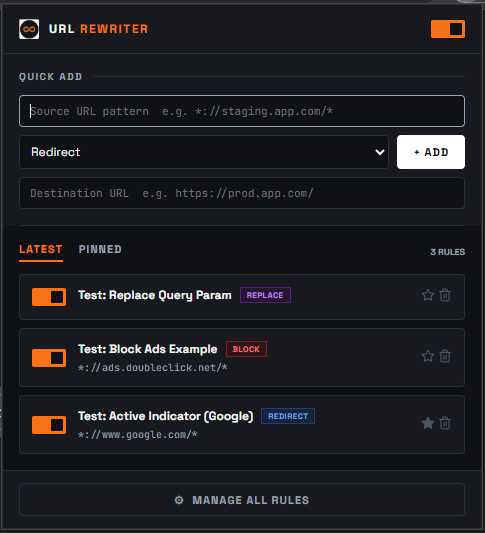
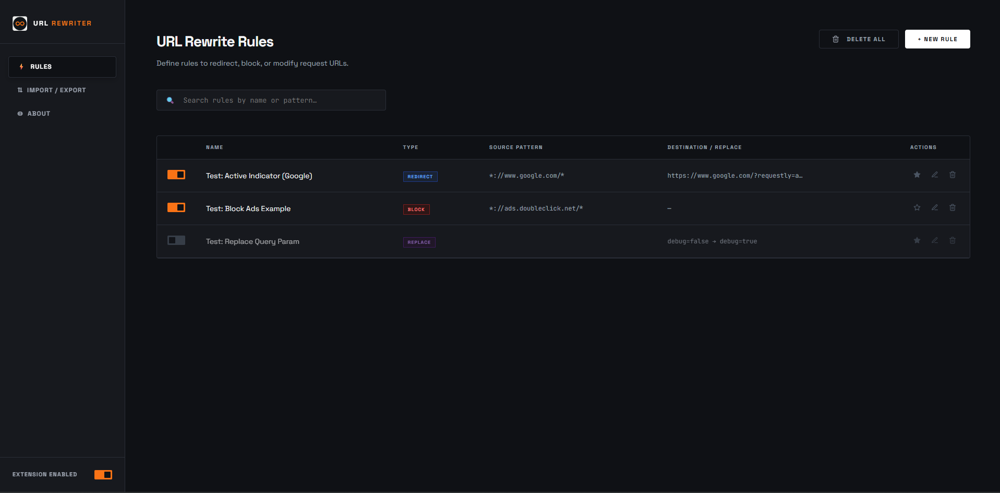
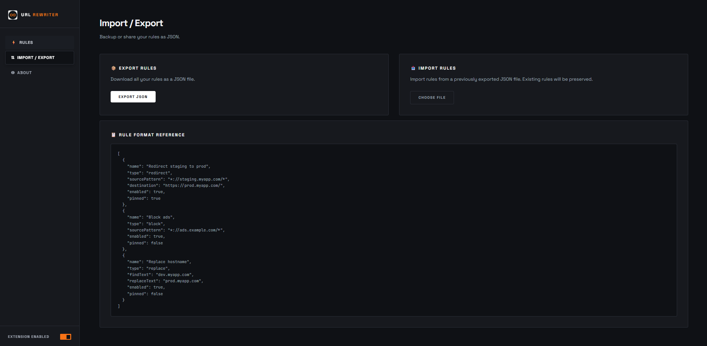
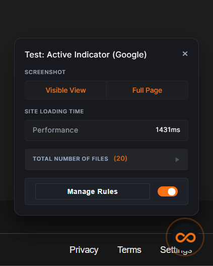

# 🔄 URL Rewriter — Chrome Extension

<p align="center">
  
</p>

<p align="center">
  <strong>High-performance request manipulation engine for Chrome, engineered for developers.</strong><br/>
  Redirect, block, or find-and-replace URLs with zero latency using Chrome's native <code>declarativeNetRequest</code> API.
</p>

<p align="center">
  
  
  
</p>

## 📸 Visual Showcase


### ⚡ Quick Control Popup
The extension popup provides rapid access to your ruleset. Designed for high efficiency, it allows you to toggle the global switch or individual rules with a single click.
*Featuring a **Quick Add** input for zero-friction rule creation and a **Pinned Tab** for high-priority workflows.*

---


### 🖥️ Management Dashboard
A centralized engine to manage complex URL rewriting logic. Integrated search and granular controls help you scale your rulesets effortlessly.
*High-performance management interface featuring **Search-as-you-type** and **Bulk Actions**.*


#### 📁 Data Sovereignty & Portability
*Your rules are yours. Export to JSON for backup or share configurations with teammates in seconds.*

---


### 📡 In-Page "Signal" Dash
When Requestly is active, a floating action pulse appears in your active tab. Click it to open a glassmorphic dashboard for real-time site insights.
*A sleek, draggable panel providing integrated site performance metrics and instant screen capture tools.*

---

## ✨ Features

| Feature | Description |
|---|---|
| **Redirect** | Transparently route requests between environments using wildcards |
| **Block** | Zero-latency request termination for trackers, ads, or unwanted scripts |
| **Find & Replace** | Granular text substitution for dynamic URL parameters and hostnames |
| **Floating Dashboard** | Real-time performance metrics and rule toggles inside every active tab |
| **Screenshots** | One-click visible or full-page screen capture from the floating menu |
| **Pinned Rules** | Pin up to **5 rules** for instant access from the popup menu |
| **Quick Add** | Add rules instantly from the popup without opening the options page |
| **Search** | Filter rules by name or URL pattern in the full dashboard |
| **Import / Export** | Backup and restore your full ruleset as a JSON file |

---

## 🚀 Installation

### Load Unpacked (Developer Mode)

1. Clone or download this repository:
   ```bash
   git clone https://github.com/wcfinfo-muthu/requestly.git
   ```

2. Open Chrome and navigate to `chrome://extensions/`

3. Enable **Developer mode** (toggle in the top-right corner)

4. Click **Load unpacked** and select the cloned `requestly/` folder

5. The extension icon will appear in your toolbar — pin it for quick access!

---

## 📋 Rule Format (Import / Export)

Rules are stored and exported as a JSON array. Each rule supports the following fields:

```json
[
  {
    "name": "Redirect staging to prod",
    "type": "redirect",
    "sourcePattern": "*://staging.myapp.com/*",
    "destination": "https://prod.myapp.com/",
    "enabled": true,
    "pinned": true
  },
  {
    "name": "Block ads",
    "type": "block",
    "sourcePattern": "*://ads.example.com/*",
    "enabled": true,
    "pinned": false
  },
  {
    "name": "Replace hostname",
    "type": "replace",
    "findText": "dev.myapp.com",
    "replaceText": "prod.myapp.com",
    "enabled": true,
    "pinned": false
  }
]
```

### Field Reference

| Field | Type | Description |
|---|---|---|
| `name` | `string` | Display name for the rule |
| `type` | `"redirect"` \| `"block"` \| `"replace"` | Rule action type |
| `sourcePattern` | `string` | URL pattern to match. Use `*` as wildcard, `*://` for both HTTP & HTTPS |
| `destination` | `string` | Target URL for redirect rules |
| `findText` | `string` | Text to find in the URL (replace rules only) |
| `replaceText` | `string` | Replacement text (replace rules only) |
| `enabled` | `boolean` | Whether the rule is active |
| `pinned` | `boolean` | Whether the rule is pinned to the popup (max 5) |

---

## 🔧 Tech Stack

- **Manifest V3** — Service worker architecture
- **declarativeNetRequest** — Native Chrome request manipulation API (< 1ms latency)
- **chrome.storage.sync** — Cloud-synced rule persistence across devices
- **Vanilla JS** — Zero dependencies, fast startup
- **Space Grotesk + JetBrains Mono** — Premium developer typography

---

## 📜 License

This project is licensed under the **MIT License** — see the [LICENSE](LICENSE) file for details.
